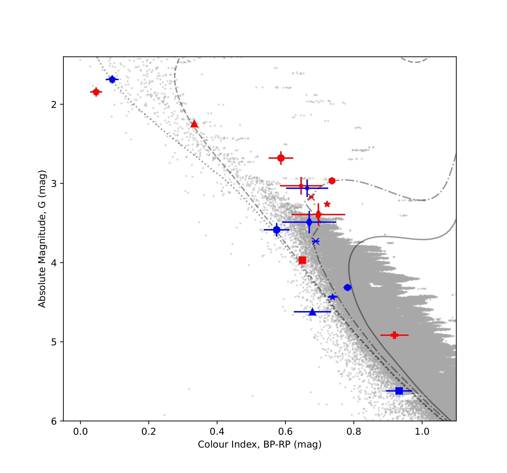

# Eclipsing Binaries as Benchmark Targets for the PLATO Mission

Characterising detached eclipsing binary star systems from **TESS** and **Gaia DR3**
photometry, to identify high-quality benchmark targets for ESA's upcoming **PLATO**
mission.

> **About this repository:** this was my final-year group research project at Keele
> University (4 students, supervised). It is published here as a record of the work,
> with a clear statement of my own contribution below and full credit to my teammates
> in [CREDITS.md](CREDITS.md). The science is unchanged from the submitted reports.



---

## The problem

ESA's **PLATO** mission will search for Earth-like planets around Sun-like stars. To
calibrate its measurements it needs **benchmark stars** — systems whose physical
properties are already known to high precision.

**Eclipsing binaries** are ideal for this. When two stars orbit each other and pass in
front of one another, the periodic dips in brightness let you measure the stars' radii,
brightness ratio, orbital inclination and period *directly from the light curve*, without
depending on stellar models.

**The task:** filter a large catalogue of candidate eclipsing binaries down to the systems
that are clean, well-characterised and Sun-like enough to serve as PLATO benchmarks.

## What we did

Starting from the Prša et al. (2022) TESS eclipsing binary catalogue, restricted to
PLATO's southern field (LOPS2) and pre-filtered on morphology < 0.6 to exclude
ellipsoidal variables:

| Stage | Tool | What happens |
|---|---|---|
| **1. Acquire** | Lightkurve | Download TESS light curves (120s cadence, SPOC pipeline) |
| **2. Clean** | Lightkurve, NumPy | Normalise, stitch sectors, mask outliers, detrend |
| **3. Find the period** | BLS periodogram | Estimate by eye, then refine over a fine period grid |
| **4. Phase-fold** | Lightkurve | Stack every orbit into a single clean cycle |
| **5. Cross-check** | Astropy, Gaia DR3 | Read `.fits` epoch photometry, align time systems, overplot on TESS |
| **6. Model** | JKTEBOP | Fit radii, inclination, surface brightness ratio, limb darkening, eccentricity |
| **7. Uncertainties** | JKTEBOP Task 8 | Monte Carlo simulation for realistic error bars |
| **8. Interpret** | Matplotlib | Place both components on a colour-magnitude diagram against MIST isochrones |

## Results

Ten systems were fully characterised, with orbital periods of 2.76–17.6 days, primary
masses 0.9–2 M☉ and effective temperatures 6100–11000 K.

- **Eight systems met PLATO's P1 sample specification** (V ≤ 11 mag)
- **All ten met the P5 criteria** (V ≤ 13 mag)
- **Best benchmark candidates:** TIC7695666, TIC349480507, TIC80556181 — all ~1 M☉ and V < 11 mag
- Systems with orbital periods above ~8 days required **eccentricity** terms to fit,
  consistent with tidal circularisation theory (Justesen & Albrecht 2021)

## My contribution

I analysed **TIC349059354** and **TIC349480507** end to end:

- TESS light curve acquisition, cleaning, outlier masking, detrending and phase-folding
- Gaia DR3 `.fits` processing across the G, BP and RP bands
- JKTEBOP model fitting for all four datasets (TESS + three Gaia bands), iterating on
  scale factor, surface brightness ratio and limb darkening until residuals flattened
- Overplotting the TESS and Gaia models to verify parameter consistency across bands
- Writing my individual research report

I also analysed **TIC307084982** for extra credit, where the system's wide separation and
unequal component sizes meant a circular orbit would not fit — so I fitted the
eccentricity terms (`e·cosω`, `e·sinω`) to achieve flat residuals.

**Not my work:** the colour-magnitude diagram plotting code and the mass interpolation
were a teammate's component; limb-darkening coefficient research was done by another
teammate. See [CREDITS.md](CREDITS.md).

## Tech stack

**Python** · **NumPy** · **pandas** · **Matplotlib** · **Lightkurve** · **Astropy**
(`io.fits`, `table`, `time`) · **JKTEBOP** (external Fortran modelling code)

## Repository structure

```
├── Pipeline/                           # The analysis pipeline (Python / Jupyter)
│   ├── master_notebook20_TIC354.ipynb  # TESS: acquire → clean → detrend → BLS → fold → export
│   ├── master_notebook_Gaia.ipynb      # Gaia DR3 .fits processing, G / BP / RP bands
│   └── Overplot_Models_TESS_&_Gaia.ipynb  # Compare TESS and Gaia model fits
│
├── Jktebop analysis/
│   ├── TESS/
│   │   ├── TIC354.in.3                 # JKTEBOP input parameters
│   │   ├── param.out.3                 # Fitted parameters
│   │   ├── model.out.3                 # Model light curve
│   │   ├── lcfit.out.3                 # Fit + residuals
│   │   ├── TIC354_ALL.dat              # Cleaned TESS light curve (JKTEBOP format)
│   │   ├── plot_jktebop8.ipynb         # Plot model overlay + residuals
│   │   └── Sample_test/                # Subsampled run used for faster iteration
│   │
│   └── Gaia/
│       ├── 5282555035278846976.fits    # Gaia DR3 epoch photometry
│       ├── {blue,green,red}.gaia.in.3  # Per-band JKTEBOP inputs
│       ├── gaia.{blue,green,red}.gaia.dat   # Cleaned per-band light curves
│       ├── param/model/lcfit .out.3    # Per-band fit outputs
│       ├── plot_jktebop8-gaia.ipynb
│       └── task8/                      # Monte Carlo uncertainties (JKTEBOP Task 8)
│           ├── param.*.gaia.out.8      # Scale factors + flux ratios with 1σ errors
│           ├── sim.*.gaia.out.8        # Monte Carlo simulation output
│           └── HRD*.ipynb              # Colour-magnitude diagram (teammate's component)
│
├── Report/
│   ├── Investigating_Eclipsing_Binaries.pdf   # My individual research report
│   └── Astro_Group_Project.pdf                # Group research note (co-authored)
│
└── figures/
    └── cmd.jpg                         # Final colour-magnitude diagram
```

### Reproducing the HRD notebooks

Two large reference datasets are **not** included here (they are public downloads, not my work):

- **MIST isochrone grid** (`MIST_v1.2_feh_p0.00_afe_p0.0_vvcrit0.0_UBVRIplus.iso.cmd`) —
  download from [the MIST project](https://waps.cfa.harvard.edu/MIST/model_grids.html)
- **Gaia HRD background sample** (`GaiaHRD2.csv`) — from the Gaia archive

Place both in `Jktebop analysis/Gaia/task8/` to run the HRD notebooks.

## References

- Prša et al. (2022), *A Catalog of Morphologically Classified Eclipsing Binary Stars*
- Southworth (2013), **JKTEBOP** v43
- Lightkurve Collaboration (2018)
- Gaia Collaboration (2018, 2023), Gaia DR2/DR3
- Dotter (2016); Choi et al. (2016); Paxton et al. (2018) — MIST isochrones
- Mamajek (2022), *A Modern Mean Dwarf Stellar Color and Effective Temperature Sequence*
- Rauer et al. (2024), *The PLATO Mission*
- Justesen & Albrecht (2021), *The Eccentricity Distribution of Short-period Binaries*
